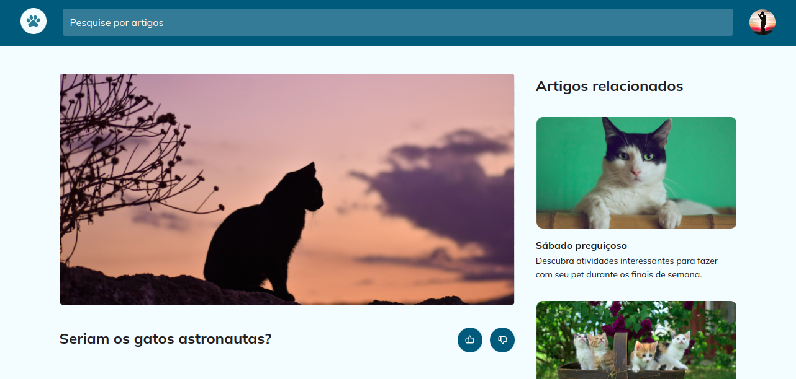

# Blog de Gatos
Bem-vindo ao **Blog de Gatos** – o refúgio digital perfeito para amantes de felinos! Nosso blog não só traz conteúdos irresistíveis sobre o mundo dos gatos, mas também oferece uma experiência de navegação encantadora. Totalmente responsivo, o site se adapta com elegância a qualquer dispositivo. Com animações suaves e interativas, cada clique é uma viagem divertida e dinâmica pelo universo felino. *Prepare-se para se apaixonar a cada rolagem!*

## 💻 Layout


## 🔧 Linguagens
 - HTML
 - CSS

## 🤖 Clonar repositório

1. Clone o repositório:
```bash
  git clone https://github.com/CaioAlves10/explorer-stage-03-blog-de-gatos.git
```

2. Entre no diretório:
```bash
  cd explorer-stage-03-blog-de-gatos
```

<br />

---

<br />

<p align="center">
  Feito com 💙 por Caio Carvalho
</p>